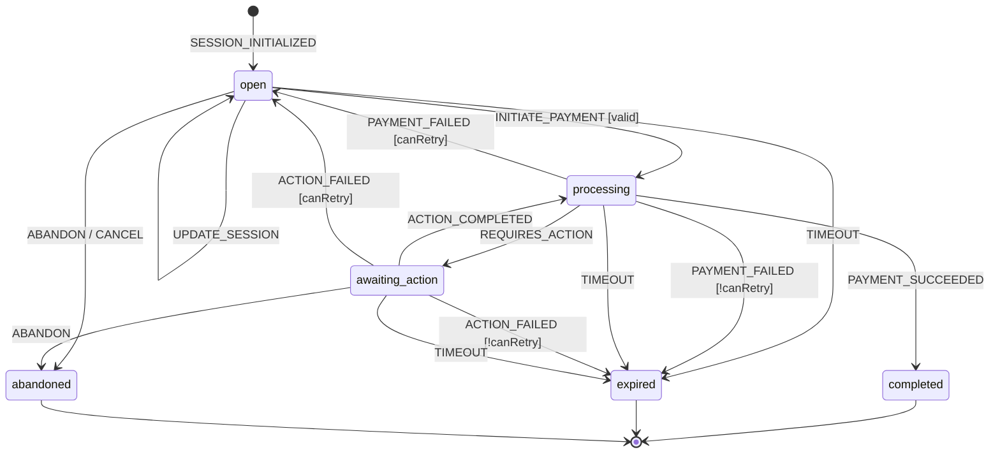

# CheckoutSession State Machine
## Complete Specification for Checkie Checkout Flow

---

## 1. State Diagram

```
┌─────────────────────────────────────────────────────────────────────────────────────────┐
│                          CHECKOUT SESSION STATE MACHINE                                  │
└─────────────────────────────────────────────────────────────────────────────────────────┘

                                    ┌─────────────┐
                                    │   CREATED   │
                                    │  (initial)  │
                                    └──────┬──────┘
                                           │
                                           │ SESSION_INITIALIZED
                                           ▼
                    ┌──────────────────────────────────────────────┐
                    │                                              │
          ┌─────────┴─────────┐                                    │
          │                   │                                    │
          │       OPEN        │◀───────────────────────────────────┤
          │                   │     PAYMENT_FAILED                 │
          │  (customer fills  │     PAYMENT_CANCELLED              │
          │   form, selects   │     ACTION_FAILED                  │
          │   variants)       │     RETRY_ALLOWED                  │
          │                   │                                    │
          └─────────┬─────────┘                                    │
                    │                                              │
                    │ INITIATE_PAYMENT                             │
                    │ [valid data]                                 │
                    ▼                                              │
          ┌───────────────────┐                                    │
          │                   │                                    │
          │    PROCESSING     │────────────────────────────────────┘
          │                   │
          │  (payment intent  │
          │   created, await  │
          │   PSP response)   │
          │                   │
          └─────────┬─────────┘
                    │
        ┌───────────┼───────────┐
        │           │           │
        │ REQUIRES  │ PAYMENT   │ PAYMENT
        │ _ACTION   │ _SUCCEEDED│ _FAILED
        │           │           │
        ▼           │           │
┌───────────────┐   │           │
│               │   │           │
│   AWAITING    │   │           │
│   _ACTION     │   │           │
│               │   │           │
│  (3DS, redir- │   │           │
│   ect, etc.)  │   │           │
│               │   │           │
└───────┬───────┘   │           │
        │           │           │
        │ ACTION    │           │
        │ _COMPLETED│           │
        │           │           │
        └─────┬─────┘           │
              │                 │
              ▼                 │
      ┌───────────────┐         │
      │               │         │
      │   COMPLETED   │◀────────┘
      │               │
      │  (payment     │
      │   successful) │
      │               │
      └───────────────┘
              ◆
          (final)


        TIMEOUT EVENTS (can occur from OPEN, PROCESSING, AWAITING_ACTION):

          ┌───────────────┐                  ┌───────────────┐
          │               │                  │               │
          │    EXPIRED    │                  │   ABANDONED   │
          │               │                  │               │
          │  (TTL passed, │                  │  (user left,  │
          │   no activity)│                  │   detected)   │
          │               │                  │               │
          └───────────────┘                  └───────────────┘
                  ◆                                  ◆
              (final)                            (final)
```

---

## 2. States Description

| State | Description | Entry Actions | Exit Actions |
|-------|-------------|---------------|--------------|
| **OPEN** | Session created, customer can fill form, select variants, enter email | Log session start, start TTL timer | Validate form data |
| **PROCESSING** | Payment initiated, waiting for PSP response | Create Payment entity, Create PaymentAttempt, Call PSP API | - |
| **AWAITING_ACTION** | Requires customer action (3DS, redirect to bank, etc.) | Store redirect URL, pause TTL timer | Resume TTL timer |
| **COMPLETED** | Payment successful, checkout finished | Create BalanceTransaction, Send confirmation email, Trigger webhooks, Update PageStats | - |
| **EXPIRED** | Session TTL exceeded without completion | Log expiration, Free any held resources | - |
| **ABANDONED** | Customer left without completing (detected by inactivity or explicit close) | Mark abandoned_at, Queue for cart recovery (future) | - |

---

## 3. Events (Triggers)

| Event | Source | Payload | Description |
|-------|--------|---------|-------------|
| `SESSION_INITIALIZED` | System | `{ pageId, pricingSnapshot }` | Session created from page load |
| `UPDATE_SESSION` | Customer | `{ variants?, customFields?, email? }` | Customer updates form data |
| `INITIATE_PAYMENT` | Customer | `{ paymentMethodId }` | Customer clicks "Pay" |
| `PAYMENT_SUCCEEDED` | PSP Webhook | `{ providerPaymentId, amount }` | PSP confirms payment |
| `PAYMENT_FAILED` | PSP Webhook | `{ failureCode, failureMessage }` | PSP reports failure |
| `REQUIRES_ACTION` | PSP Response | `{ actionType, redirectUrl }` | 3DS or redirect required |
| `ACTION_COMPLETED` | PSP Webhook | `{ threeDSResult }` | Customer completed 3DS/action |
| `ACTION_FAILED` | PSP Webhook | `{ failureReason }` | Customer failed/cancelled action |
| `TIMEOUT` | System Timer | `{ reason: 'ttl_exceeded' }` | Session TTL expired |
| `ABANDON` | System/Client | `{ reason }` | Detected abandonment |
| `CANCEL` | Customer | `{}` | Explicit cancellation |

---

## 4. Transitions

| From | Event | To | Guard | Actions |
|------|-------|-----|-------|---------|
| `OPEN` | `UPDATE_SESSION` | `OPEN` | - | updateSessionData() |
| `OPEN` | `INITIATE_PAYMENT` | `PROCESSING` | isValidForPayment() | createPayment(), createPaymentAttempt(), callPSP() |
| `OPEN` | `TIMEOUT` | `EXPIRED` | - | markExpired() |
| `OPEN` | `ABANDON` | `ABANDONED` | - | markAbandoned() |
| `OPEN` | `CANCEL` | `ABANDONED` | - | markAbandoned() |
| `PROCESSING` | `PAYMENT_SUCCEEDED` | `COMPLETED` | - | completePayment(), updateBalance(), sendNotifications() |
| `PROCESSING` | `PAYMENT_FAILED` | `OPEN` | canRetry() | recordFailure(), incrementAttempt() |
| `PROCESSING` | `PAYMENT_FAILED` | `EXPIRED` | !canRetry() | recordFailure(), markExpired() |
| `PROCESSING` | `REQUIRES_ACTION` | `AWAITING_ACTION` | - | storeActionDetails() |
| `PROCESSING` | `TIMEOUT` | `EXPIRED` | - | cancelPaymentIntent(), markExpired() |
| `AWAITING_ACTION` | `ACTION_COMPLETED` | `PROCESSING` | - | updateAttemptStatus() |
| `AWAITING_ACTION` | `ACTION_FAILED` | `OPEN` | canRetry() | recordFailure() |
| `AWAITING_ACTION` | `ACTION_FAILED` | `EXPIRED` | !canRetry() | recordFailure(), markExpired() |
| `AWAITING_ACTION` | `TIMEOUT` | `EXPIRED` | - | markExpired() |
| `AWAITING_ACTION` | `ABANDON` | `ABANDONED` | - | markAbandoned() |

---

## 5. Guards (Conditions)

```typescript
// Guards определяют, разрешён ли переход

interface Guards {
  /**
   * Проверяет, что сессия содержит все необходимые данные для платежа
   */
  isValidForPayment(context: CheckoutSessionContext): boolean;
  
  /**
   * Проверяет, можно ли сделать ещё одну попытку оплаты
   * (максимум 3 попытки, сессия не истекла)
   */
  canRetry(context: CheckoutSessionContext): boolean;
  
  /**
   * Проверяет, что сумма соответствует ожидаемой
   */
  isAmountValid(context: CheckoutSessionContext, event: PaymentEvent): boolean;
}
```

### Guard Implementations

```typescript
const guards = {
  isValidForPayment: (context: CheckoutSessionContext): boolean => {
    const { session } = context;
    
    // Required fields
    if (!session.customerId && !session.customerEmail) return false;
    if (!session.amount || session.amount <= 0) return false;
    
    // Check required custom fields
    const requiredFields = session.page.customFields.filter(f => f.isRequired);
    for (const field of requiredFields) {
      const value = session.customFieldValues.find(v => v.customFieldId === field.id);
      if (!value || !value.value) return false;
    }
    
    // Check required variants
    const requiredVariants = session.page.variants.filter(v => v.isRequired);
    for (const variant of requiredVariants) {
      const selected = session.selectedVariants?.[variant.id];
      if (!selected) return false;
    }
    
    // Session not expired
    if (new Date() > session.expiresAt) return false;
    
    return true;
  },
  
  canRetry: (context: CheckoutSessionContext): boolean => {
    const { session, attempts } = context;
    
    // Max 3 attempts
    if (attempts.length >= 3) return false;
    
    // Session still valid
    if (new Date() > session.expiresAt) return false;
    
    // Last failure was retryable
    const lastAttempt = attempts[attempts.length - 1];
    const nonRetryableCodes = [
      'card_declined_fraud',
      'stolen_card',
      'lost_card',
      'insufficient_funds', // Debatable, but usually not worth retrying immediately
    ];
    
    if (lastAttempt && nonRetryableCodes.includes(lastAttempt.failureCode)) {
      return false;
    }
    
    return true;
  },
  
  isAmountValid: (context: CheckoutSessionContext, event: PaymentSucceededEvent): boolean => {
    // Amount from PSP should match session amount (with small tolerance for FX)
    const tolerance = 0.01; // 1 cent
    return Math.abs(Number(context.session.amount) - event.amount) <= tolerance;
  },
};
```

---

## 6. Actions

```typescript
interface Actions {
  // Session lifecycle
  updateSessionData(context, event): void;
  markExpired(context): void;
  markAbandoned(context): void;
  
  // Payment flow
  createPayment(context): Payment;
  createPaymentAttempt(context, payment): PaymentAttempt;
  callPSP(context, payment, attempt): PSPResponse;
  
  // PSP responses
  storeActionDetails(context, event): void;
  updateAttemptStatus(context, event): void;
  recordFailure(context, event): void;
  incrementAttempt(context): void;
  cancelPaymentIntent(context): void;
  
  // Completion
  completePayment(context, event): void;
  updateBalance(context, payment): void;
  sendNotifications(context, payment): void;
  updatePageStats(context, payment): void;
  triggerWebhooks(context, payment): void;
}
```

### Action Implementations

```typescript
const actions = {
  // ─────────────────────────────────────────────────────────────────────────
  // SESSION LIFECYCLE
  // ─────────────────────────────────────────────────────────────────────────
  
  updateSessionData: async (
    context: CheckoutSessionContext,
    event: UpdateSessionEvent
  ): Promise<void> => {
    const { session } = context;
    
    await prisma.checkoutSession.update({
      where: { id: session.id },
      data: {
        selectedVariants: event.variants ?? session.selectedVariants,
        customerId: event.customerId ?? session.customerId,
        updatedAt: new Date(),
      },
    });
    
    // Update custom field values if provided
    if (event.customFields) {
      for (const [fieldId, value] of Object.entries(event.customFields)) {
        await prisma.customFieldValue.upsert({
          where: {
            customFieldId_checkoutSessionId: {
              customFieldId: fieldId,
              checkoutSessionId: session.id,
            },
          },
          create: {
            customFieldId: fieldId,
            checkoutSessionId: session.id,
            value: String(value),
          },
          update: {
            value: String(value),
          },
        });
      }
    }
  },
  
  markExpired: async (context: CheckoutSessionContext): Promise<void> => {
    await prisma.checkoutSession.update({
      where: { id: context.session.id },
      data: {
        status: 'EXPIRED',
        updatedAt: new Date(),
      },
    });
    
    // Log for analytics
    await logSessionEvent(context.session.id, 'expired', {
      reason: 'ttl_exceeded',
      duration: Date.now() - context.session.createdAt.getTime(),
    });
  },
  
  markAbandoned: async (
    context: CheckoutSessionContext,
    event?: AbandonEvent
  ): Promise<void> => {
    await prisma.checkoutSession.update({
      where: { id: context.session.id },
      data: {
        status: 'ABANDONED',
        abandonedAt: new Date(),
        updatedAt: new Date(),
      },
    });
    
    // Queue for cart recovery (future feature)
    if (context.session.customerId) {
      await cartRecoveryQueue.add('abandoned_checkout', {
        sessionId: context.session.id,
        customerId: context.session.customerId,
        pageId: context.session.pageId,
        amount: context.session.amount,
      }, {
        delay: 30 * 60 * 1000, // 30 minutes delay
      });
    }
  },
  
  // ─────────────────────────────────────────────────────────────────────────
  // PAYMENT FLOW
  // ─────────────────────────────────────────────────────────────────────────
  
  createPayment: async (context: CheckoutSessionContext): Promise<Payment> => {
    const { session } = context;
    
    // Get or create customer
    let customerId = session.customerId;
    if (!customerId && session.customerEmail) {
      const customer = await prisma.customer.upsert({
        where: {
          storeId_email: {
            storeId: session.storeId,
            email: session.customerEmail,
          },
        },
        create: {
          storeId: session.storeId,
          email: session.customerEmail,
          firstName: session.customerFirstName,
          lastName: session.customerLastName,
        },
        update: {},
      });
      customerId = customer.id;
      
      // Update session with customer
      await prisma.checkoutSession.update({
        where: { id: session.id },
        data: { customerId },
      });
    }
    
    // Calculate fees
    const platformFeePercent = 0.029; // 2.9%
    const platformFee = Number(session.amount) * platformFeePercent;
    const netAmount = Number(session.amount) - platformFee;
    
    const payment = await prisma.payment.create({
      data: {
        storeId: session.storeId,
        pageId: session.pageId,
        customerId: customerId!,
        amount: session.amount,
        currency: session.currency,
        status: 'PENDING',
        paymentProvider: context.selectedProvider,
        couponId: session.couponId,
        discountAmount: session.discountAmount,
        platformFee,
        netAmount,
      },
    });
    
    // Link session to payment
    await prisma.checkoutSession.update({
      where: { id: session.id },
      data: { paymentId: payment.id },
    });
    
    // Copy custom field values to payment
    await prisma.customFieldValue.updateMany({
      where: { checkoutSessionId: session.id },
      data: { paymentId: payment.id },
    });
    
    return payment;
  },
  
  createPaymentAttempt: async (
    context: CheckoutSessionContext,
    payment: Payment
  ): Promise<PaymentAttempt> => {
    const attemptNumber = context.attempts.length + 1;
    
    return prisma.paymentAttempt.create({
      data: {
        paymentId: payment.id,
        checkoutSessionId: context.session.id,
        attemptNumber,
        providerId: context.selectedProvider,
        status: 'PENDING',
      },
    });
  },
  
  callPSP: async (
    context: CheckoutSessionContext,
    payment: Payment,
    attempt: PaymentAttempt
  ): Promise<PSPResponse> => {
    const provider = await getPaymentProvider(context.selectedProvider);
    
    try {
      const response = await provider.createPaymentIntent({
        amount: Number(payment.amount),
        currency: payment.currency,
        metadata: {
          checkoutSessionId: context.session.id,
          paymentId: payment.id,
          attemptId: attempt.id,
          storeId: context.session.storeId,
        },
        // For 3DS
        returnUrl: `${config.widgetUrl}/checkout/${context.session.id}/return`,
      });
      
      // Update attempt with provider response
      await prisma.paymentAttempt.update({
        where: { id: attempt.id },
        data: {
          providerAttemptId: response.id,
          status: response.requiresAction ? 'REQUIRES_ACTION' : 'PROCESSING',
          requires3DS: response.requiresAction,
          redirectUrl: response.redirectUrl,
          providerResponse: response.raw,
        },
      });
      
      // Update payment with provider ID
      await prisma.payment.update({
        where: { id: payment.id },
        data: {
          providerPaymentId: response.id,
          status: 'PROCESSING',
        },
      });
      
      return response;
      
    } catch (error) {
      // Log PSP error
      await prisma.paymentAttempt.update({
        where: { id: attempt.id },
        data: {
          status: 'FAILED',
          failureCode: error.code || 'psp_error',
          failureMessage: error.message,
        },
      });
      
      throw error;
    }
  },
  
  // ─────────────────────────────────────────────────────────────────────────
  // PSP RESPONSES
  // ─────────────────────────────────────────────────────────────────────────
  
  storeActionDetails: async (
    context: CheckoutSessionContext,
    event: RequiresActionEvent
  ): Promise<void> => {
    const latestAttempt = context.attempts[context.attempts.length - 1];
    
    await prisma.paymentAttempt.update({
      where: { id: latestAttempt.id },
      data: {
        status: 'REQUIRES_ACTION',
        requires3DS: event.actionType === '3ds',
        redirectUrl: event.redirectUrl,
      },
    });
  },
  
  recordFailure: async (
    context: CheckoutSessionContext,
    event: PaymentFailedEvent
  ): Promise<void> => {
    const latestAttempt = context.attempts[context.attempts.length - 1];
    
    await prisma.paymentAttempt.update({
      where: { id: latestAttempt.id },
      data: {
        status: 'FAILED',
        failureCode: event.failureCode,
        failureMessage: event.failureMessage,
        completedAt: new Date(),
      },
    });
    
    // Update payment status if no more retries
    if (!guards.canRetry(context)) {
      await prisma.payment.update({
        where: { id: context.session.paymentId! },
        data: { status: 'FAILED' },
      });
    }
  },
  
  cancelPaymentIntent: async (context: CheckoutSessionContext): Promise<void> => {
    if (!context.session.paymentId) return;
    
    const payment = await prisma.payment.findUnique({
      where: { id: context.session.paymentId },
    });
    
    if (payment?.providerPaymentId) {
      const provider = await getPaymentProvider(payment.paymentProvider);
      await provider.cancelPaymentIntent(payment.providerPaymentId);
    }
    
    await prisma.payment.update({
      where: { id: context.session.paymentId },
      data: { status: 'CANCELLED' },
    });
  },
  
  // ─────────────────────────────────────────────────────────────────────────
  // COMPLETION
  // ─────────────────────────────────────────────────────────────────────────
  
  completePayment: async (
    context: CheckoutSessionContext,
    event: PaymentSucceededEvent
  ): Promise<void> => {
    const latestAttempt = context.attempts[context.attempts.length - 1];
    
    // Update attempt
    await prisma.paymentAttempt.update({
      where: { id: latestAttempt.id },
      data: {
        status: 'SUCCEEDED',
        completedAt: new Date(),
      },
    });
    
    // Update payment
    await prisma.payment.update({
      where: { id: context.session.paymentId! },
      data: {
        status: 'COMPLETED',
        completedAt: new Date(),
        providerData: event.providerData,
      },
    });
    
    // Update session
    await prisma.checkoutSession.update({
      where: { id: context.session.id },
      data: {
        status: 'COMPLETED',
        completedAt: new Date(),
      },
    });
  },
  
  updateBalance: async (
    context: CheckoutSessionContext,
    payment: Payment
  ): Promise<void> => {
    // Get current balance
    const lastTransaction = await prisma.balanceTransaction.findFirst({
      where: { storeId: context.session.storeId },
      orderBy: { createdAt: 'desc' },
    });
    
    const currentBalance = lastTransaction?.balanceAfter ?? new Decimal(0);
    const newBalance = currentBalance.plus(payment.netAmount);
    
    await prisma.balanceTransaction.create({
      data: {
        storeId: context.session.storeId,
        paymentId: payment.id,
        type: 'PAYMENT_RECEIVED',
        amount: payment.netAmount,
        currency: payment.currency,
        balanceAfter: newBalance,
        description: `Payment for ${context.session.page.name}`,
        externalReference: payment.providerPaymentId,
      },
    });
  },
  
  sendNotifications: async (
    context: CheckoutSessionContext,
    payment: Payment
  ): Promise<void> => {
    const customer = await prisma.customer.findUnique({
      where: { id: payment.customerId },
    });
    
    const store = await prisma.store.findUnique({
      where: { id: context.session.storeId },
    });
    
    // Send confirmation to customer
    await emailQueue.add('send_email', {
      template: 'payment_confirmation',
      to: customer!.email,
      data: {
        customerName: customer!.firstName || 'Customer',
        pageName: context.session.page.name,
        amount: formatCurrency(payment.amount, payment.currency),
        storeName: store!.name,
        receiptUrl: `${config.widgetUrl}/receipt/${payment.id}`,
      },
    });
    
    // Notify merchant
    if (store!.supportEmail) {
      await emailQueue.add('send_email', {
        template: 'merchant_payment_notification',
        to: store!.supportEmail,
        data: {
          customerEmail: customer!.email,
          pageName: context.session.page.name,
          amount: formatCurrency(payment.amount, payment.currency),
          dashboardUrl: `${config.appUrl}/stores/${store!.id}/payments/${payment.id}`,
        },
      });
    }
  },
  
  updatePageStats: async (
    context: CheckoutSessionContext,
    payment: Payment
  ): Promise<void> => {
    // Atomic update to avoid race conditions
    await prisma.$executeRaw`
      UPDATE page_stats
      SET 
        conversion_count = conversion_count + 1,
        total_revenue = total_revenue + ${payment.amount},
        last_conversion_at = NOW(),
        updated_at = NOW()
      WHERE page_id = ${context.session.pageId}
    `;
  },
  
  triggerWebhooks: async (
    context: CheckoutSessionContext,
    payment: Payment
  ): Promise<void> => {
    // Create webhook event
    const event = await prisma.webhookEvent.create({
      data: {
        storeId: context.session.storeId,
        type: 'payment.completed',
        resourceType: 'payment',
        resourceId: payment.id,
        payload: {
          payment: {
            id: payment.id,
            amount: payment.amount,
            currency: payment.currency,
            status: payment.status,
            customerId: payment.customerId,
            pageId: payment.pageId,
            completedAt: payment.completedAt,
          },
          session: {
            id: context.session.id,
            selectedVariants: context.session.selectedVariants,
          },
        },
      },
    });
    
    // Get active endpoints
    const endpoints = await prisma.webhookEndpoint.findMany({
      where: {
        storeId: context.session.storeId,
        isActive: true,
        events: { has: 'payment.completed' },
      },
    });
    
    // Queue deliveries
    for (const endpoint of endpoints) {
      const delivery = await prisma.webhookDelivery.create({
        data: {
          webhookEventId: event.id,
          endpointId: endpoint.id,
          status: 'PENDING',
          scheduledAt: new Date(),
        },
      });
      
      await webhookQueue.add('deliver', {
        deliveryId: delivery.id,
      });
    }
  },
};
```

---

## 7. XState Machine Definition

```typescript
// checkout-session.machine.ts

import { createMachine, assign } from 'xstate';

interface CheckoutSessionContext {
  sessionId: string;
  storeId: string;
  pageId: string;
  customerId: string | null;
  customerEmail: string | null;
  amount: number;
  currency: string;
  selectedVariants: Record<string, string>;
  customFieldValues: Record<string, string>;
  couponId: string | null;
  discountAmount: number;
  
  paymentId: string | null;
  attempts: PaymentAttemptInfo[];
  
  error: string | null;
  redirectUrl: string | null;
}

type CheckoutSessionEvent =
  | { type: 'UPDATE_SESSION'; data: Partial<CheckoutSessionContext> }
  | { type: 'INITIATE_PAYMENT'; paymentMethodId: string }
  | { type: 'PAYMENT_SUCCEEDED'; providerPaymentId: string; amount: number }
  | { type: 'PAYMENT_FAILED'; failureCode: string; failureMessage: string }
  | { type: 'REQUIRES_ACTION'; actionType: string; redirectUrl: string }
  | { type: 'ACTION_COMPLETED'; threeDSResult: string }
  | { type: 'ACTION_FAILED'; failureReason: string }
  | { type: 'TIMEOUT' }
  | { type: 'ABANDON'; reason?: string }
  | { type: 'CANCEL' };

export const checkoutSessionMachine = createMachine<
  CheckoutSessionContext,
  CheckoutSessionEvent
>({
  id: 'checkoutSession',
  initial: 'open',
  
  context: {
    sessionId: '',
    storeId: '',
    pageId: '',
    customerId: null,
    customerEmail: null,
    amount: 0,
    currency: 'USD',
    selectedVariants: {},
    customFieldValues: {},
    couponId: null,
    discountAmount: 0,
    paymentId: null,
    attempts: [],
    error: null,
    redirectUrl: null,
  },
  
  states: {
    // ─────────────────────────────────────────────────────────────────────
    // OPEN: Customer filling form
    // ─────────────────────────────────────────────────────────────────────
    open: {
      entry: ['logStateEntry'],
      
      on: {
        UPDATE_SESSION: {
          target: 'open',
          actions: ['updateSessionData'],
        },
        
        INITIATE_PAYMENT: [
          {
            target: 'processing',
            cond: 'isValidForPayment',
            actions: ['createPayment', 'createPaymentAttempt'],
          },
          {
            target: 'open',
            actions: ['setValidationError'],
          },
        ],
        
        TIMEOUT: {
          target: 'expired',
          actions: ['markExpired'],
        },
        
        ABANDON: {
          target: 'abandoned',
          actions: ['markAbandoned'],
        },
        
        CANCEL: {
          target: 'abandoned',
          actions: ['markAbandoned'],
        },
      },
      
      after: {
        // Auto-expire after session TTL (e.g., 60 minutes)
        SESSION_TTL: {
          target: 'expired',
          actions: ['markExpired'],
        },
      },
    },
    
    // ─────────────────────────────────────────────────────────────────────
    // PROCESSING: Payment in progress
    // ─────────────────────────────────────────────────────────────────────
    processing: {
      entry: ['logStateEntry', 'callPSP'],
      
      on: {
        PAYMENT_SUCCEEDED: {
          target: 'completed',
          cond: 'isAmountValid',
          actions: [
            'completePayment',
            'updateBalance',
            'updatePageStats',
            'sendNotifications',
            'triggerWebhooks',
          ],
        },
        
        PAYMENT_FAILED: [
          {
            target: 'open',
            cond: 'canRetry',
            actions: ['recordFailure', 'incrementAttempt'],
          },
          {
            target: 'expired',
            actions: ['recordFailure', 'markExpired'],
          },
        ],
        
        REQUIRES_ACTION: {
          target: 'awaiting_action',
          actions: ['storeActionDetails'],
        },
        
        TIMEOUT: {
          target: 'expired',
          actions: ['cancelPaymentIntent', 'markExpired'],
        },
      },
      
      after: {
        // Processing timeout (e.g., 5 minutes)
        PROCESSING_TIMEOUT: {
          target: 'open',
          cond: 'canRetry',
          actions: ['recordTimeout', 'incrementAttempt'],
        },
      },
    },
    
    // ─────────────────────────────────────────────────────────────────────
    // AWAITING_ACTION: Waiting for customer action (3DS, redirect)
    // ─────────────────────────────────────────────────────────────────────
    awaiting_action: {
      entry: ['logStateEntry', 'pauseTTL'],
      exit: ['resumeTTL'],
      
      on: {
        ACTION_COMPLETED: {
          target: 'processing',
          actions: ['updateAttemptStatus'],
        },
        
        ACTION_FAILED: [
          {
            target: 'open',
            cond: 'canRetry',
            actions: ['recordFailure'],
          },
          {
            target: 'expired',
            actions: ['recordFailure', 'markExpired'],
          },
        ],
        
        TIMEOUT: {
          target: 'expired',
          actions: ['markExpired'],
        },
        
        ABANDON: {
          target: 'abandoned',
          actions: ['markAbandoned'],
        },
      },
      
      after: {
        // Action timeout (e.g., 15 minutes for 3DS)
        ACTION_TIMEOUT: {
          target: 'expired',
          actions: ['markExpired'],
        },
      },
    },
    
    // ─────────────────────────────────────────────────────────────────────
    // FINAL STATES
    // ─────────────────────────────────────────────────────────────────────
    completed: {
      type: 'final',
      entry: ['logStateEntry', 'logCompletion'],
      
      data: (context) => ({
        sessionId: context.sessionId,
        paymentId: context.paymentId,
        amount: context.amount,
        currency: context.currency,
      }),
    },
    
    expired: {
      type: 'final',
      entry: ['logStateEntry', 'logExpiration'],
    },
    
    abandoned: {
      type: 'final',
      entry: ['logStateEntry', 'logAbandonment', 'queueCartRecovery'],
    },
  },
}, {
  guards: {
    isValidForPayment: (context) => {
      if (!context.customerEmail && !context.customerId) return false;
      if (!context.amount || context.amount <= 0) return false;
      return true;
    },
    
    canRetry: (context) => {
      return context.attempts.length < 3;
    },
    
    isAmountValid: (context, event) => {
      if (event.type !== 'PAYMENT_SUCCEEDED') return false;
      return Math.abs(context.amount - event.amount) <= 0.01;
    },
  },
  
  delays: {
    SESSION_TTL: (context) => {
      // Default 60 minutes, can be configured per page
      return 60 * 60 * 1000;
    },
    
    PROCESSING_TIMEOUT: 5 * 60 * 1000, // 5 minutes
    
    ACTION_TIMEOUT: 15 * 60 * 1000, // 15 minutes for 3DS
  },
  
  actions: {
    logStateEntry: (context, event, meta) => {
      console.log(`[Session ${context.sessionId}] Entered state: ${meta.state.value}`);
    },
    
    updateSessionData: assign((context, event) => {
      if (event.type !== 'UPDATE_SESSION') return context;
      return { ...context, ...event.data };
    }),
    
    setValidationError: assign({
      error: 'Validation failed: missing required fields',
    }),
    
    incrementAttempt: assign({
      attempts: (context) => [
        ...context.attempts,
        { attemptNumber: context.attempts.length + 1, status: 'pending' },
      ],
    }),
    
    // ... other actions would call the service functions defined earlier
  },
});
```

---

## 8. Service Integration

```typescript
// checkout-session.service.ts

import { Injectable } from '@nestjs/common';
import { interpret, State } from 'xstate';
import { checkoutSessionMachine } from './checkout-session.machine';
import { PrismaService } from '../prisma/prisma.service';
import { RedisService } from '../redis/redis.service';

@Injectable()
export class CheckoutSessionService {
  constructor(
    private prisma: PrismaService,
    private redis: RedisService,
  ) {}
  
  /**
   * Create a new checkout session
   */
  async createSession(pageId: string, metadata: SessionMetadata): Promise<CheckoutSession> {
    const page = await this.prisma.page.findUniqueOrThrow({
      where: { id: pageId },
      include: { store: true, variants: true, customFields: true },
    });
    
    // Create pricing snapshot
    const pricingSnapshot = {
      price: page.price,
      pricingType: page.pricingType,
      currency: page.currency,
      variants: page.variants.map(v => ({
        id: v.id,
        name: v.name,
        options: v.options,
      })),
      capturedAt: new Date().toISOString(),
    };
    
    // Calculate expiry
    const ttlMinutes = page.sessionTtlMinutes || 60;
    const expiresAt = new Date(Date.now() + ttlMinutes * 60 * 1000);
    
    // Create session in DB
    const session = await this.prisma.checkoutSession.create({
      data: {
        storeId: page.storeId,
        pageId: page.id,
        status: 'OPEN',
        amount: page.price || 0,
        currency: page.currency,
        pricingSnapshot,
        expiresAt,
        ipAddress: metadata.ipAddress,
        userAgent: metadata.userAgent,
        referrer: metadata.referrer,
        utmSource: metadata.utmSource,
        utmMedium: metadata.utmMedium,
        utmCampaign: metadata.utmCampaign,
      },
    });
    
    // Initialize state machine in Redis
    const initialState = checkoutSessionMachine.initialState;
    await this.saveState(session.id, initialState);
    
    // Schedule expiry check
    await this.scheduleExpiryCheck(session.id, expiresAt);
    
    return session;
  }
  
  /**
   * Send event to session state machine
   */
  async sendEvent(
    sessionId: string,
    event: CheckoutSessionEvent
  ): Promise<{ state: string; context: any }> {
    // Load current state
    const savedState = await this.loadState(sessionId);
    
    // Create service from saved state
    const service = interpret(checkoutSessionMachine)
      .start(savedState);
    
    // Send event
    service.send(event);
    
    // Get new state
    const newState = service.state;
    
    // Save state
    await this.saveState(sessionId, newState);
    
    // If final state, cleanup
    if (newState.done) {
      await this.cleanupSession(sessionId);
    }
    
    return {
      state: String(newState.value),
      context: newState.context,
    };
  }
  
  /**
   * Handle PSP webhook
   */
  async handleWebhook(
    provider: string,
    eventType: string,
    payload: any
  ): Promise<void> {
    // Extract session ID from metadata
    const sessionId = payload.metadata?.checkoutSessionId;
    if (!sessionId) {
      throw new Error('Missing checkoutSessionId in webhook metadata');
    }
    
    // Map PSP event to state machine event
    const event = this.mapWebhookToEvent(provider, eventType, payload);
    if (!event) {
      console.log(`Ignoring webhook event: ${eventType}`);
      return;
    }
    
    // Send event to state machine
    await this.sendEvent(sessionId, event);
  }
  
  // ─────────────────────────────────────────────────────────────────────────
  // PRIVATE HELPERS
  // ─────────────────────────────────────────────────────────────────────────
  
  private async saveState(sessionId: string, state: State<any>): Promise<void> {
    const serialized = JSON.stringify(state);
    await this.redis.set(
      `checkout:session:${sessionId}:state`,
      serialized,
      'EX',
      3600 * 24 // 24 hours
    );
  }
  
  private async loadState(sessionId: string): Promise<State<any>> {
    const serialized = await this.redis.get(`checkout:session:${sessionId}:state`);
    if (!serialized) {
      // Load from DB as fallback
      const session = await this.prisma.checkoutSession.findUniqueOrThrow({
        where: { id: sessionId },
      });
      
      // Reconstruct state from DB status
      return this.reconstructState(session);
    }
    
    return State.create(JSON.parse(serialized));
  }
  
  private reconstructState(session: CheckoutSession): State<any> {
    // Map DB status to XState state
    const stateValue = session.status.toLowerCase();
    
    return checkoutSessionMachine.resolveState(
      State.from(stateValue, {
        sessionId: session.id,
        storeId: session.storeId,
        pageId: session.pageId,
        customerId: session.customerId,
        amount: Number(session.amount),
        currency: session.currency,
        selectedVariants: session.selectedVariants || {},
        paymentId: session.paymentId,
        attempts: [],
      })
    );
  }
  
  private mapWebhookToEvent(
    provider: string,
    eventType: string,
    payload: any
  ): CheckoutSessionEvent | null {
    if (provider === 'stripe') {
      switch (eventType) {
        case 'payment_intent.succeeded':
          return {
            type: 'PAYMENT_SUCCEEDED',
            providerPaymentId: payload.id,
            amount: payload.amount / 100, // Stripe uses cents
          };
          
        case 'payment_intent.payment_failed':
          return {
            type: 'PAYMENT_FAILED',
            failureCode: payload.last_payment_error?.code || 'unknown',
            failureMessage: payload.last_payment_error?.message || 'Payment failed',
          };
          
        case 'payment_intent.requires_action':
          return {
            type: 'REQUIRES_ACTION',
            actionType: '3ds',
            redirectUrl: payload.next_action?.redirect_to_url?.url || '',
          };
          
        default:
          return null;
      }
    }
    
    // Add other providers...
    return null;
  }
  
  private async scheduleExpiryCheck(sessionId: string, expiresAt: Date): Promise<void> {
    const delay = expiresAt.getTime() - Date.now();
    
    await this.redis.zadd(
      'checkout:sessions:expiry',
      expiresAt.getTime(),
      sessionId
    );
  }
  
  private async cleanupSession(sessionId: string): Promise<void> {
    await this.redis.del(`checkout:session:${sessionId}:state`);
    await this.redis.zrem('checkout:sessions:expiry', sessionId);
  }
}
```

---

## 9. Mermaid State Diagram



---

## 10. Summary

### States

| State | Description | Typical Duration |
|-------|-------------|------------------|
| OPEN | Customer filling form | 1-30 min |
| PROCESSING | PSP processing payment | 1-10 sec |
| AWAITING_ACTION | Waiting for 3DS/redirect | 1-15 min |
| COMPLETED | Success (final) | - |
| EXPIRED | Timed out (final) | - |
| ABANDONED | Customer left (final) | - |

### Key Design Decisions

1. **Retry in OPEN state**: After payment failure, return to OPEN to allow customer to try again
2. **3DS as separate state**: AWAITING_ACTION allows pausing TTL timer during redirect
3. **Idempotent webhooks**: State machine naturally handles duplicate webhook events
4. **Redis + DB persistence**: Fast state access in Redis, durable storage in PostgreSQL
5. **Max 3 attempts**: Prevent abuse while allowing reasonable retries

### Metrics to Track

- Session → Completed conversion rate
- Average time in each state
- Failure codes distribution
- 3DS completion rate
- Abandonment rate by page

---

*State Machine Specification v1.0*
